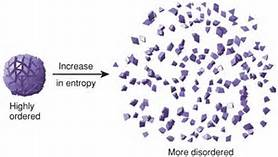

## There Will Be Order!!

  

Everything in the world has a state of order, although nature has a predilection to entropy, or disorder. We as humans devise ingenious methods and inventions to keep things in an orderly fashion. Even software engineers have their own way of keeping things nice and tidy. Ever since I started programming in the introductory computer science class, I had always been taught about coding standards. We had to implement them in every little assignment, and of course, projects. I always thought they were kind of annoying because if one were to make even a slight mistake and it were to be caught by the teaching assistant, one’s grade would surely be penalized. When I saw my penalized grades I was always a bit upset and wondered why it even mattered. The more I think about it now, though, I understand the importance of coding style, and keeping a well ordered set of rules while coding.

## Understanding the Fundamentals

  

When learning to code, making sure the curly braces are one space away from the for loop or have it on an entirely different line seem like such annoying nuances. And don’t get me wrong, the subtleties are very annoying; however, in most cases there is a method to the madness. When I first started learning java I always had a hard time with the curly braces. Especially in nested for loops and nested while loops, where there are a lot of things going on in one place and it’s hard to keep track of where one loop starts and one begins. That is when I started realizing how important the curly braces really were. After asking the teaching assistant about the curly braces and he explained that the last closing brace would close the last open brace and everything made sense to me.  When I first started I just put the curly braces anywhere, but when the coding standards explained to line them up with the respective for/while loops, I realized how much easier it made understanding the code. Ultimately, I believe that the use of coding standards is useful for people to understand each other’s code and make sure everything is not too hard to read.

## ESLint

  

Every class I have had, I had to learn different coding standards. ICS 314 is no different, although the standards are very similar to ICS 211, where I liked the coding standard the best so I am happy about that. But classes like ICS 212 have much different coding standards, curly braces on a new line, and 4 spaces for every line after a for loop and I hate conforming to it so much, but ultimately I have no say. When using Intellij, the coding standard feels natural to me, especially with the customized feature that automatically makes the indentations for us. I have no problems getting a check mark with ESLint, unless of course it is my own fault like forgetting to turn off the javascript inspections and thus being unable to increment. 

## Conclusion

Conclusively, back in my early days, I didn’t really understand the importance of coding style/standards, but now I understand that they are important when collaborating with others, because it makes one’s code much easier to read and understand. Also, understanding the placement of the curly braces relative to a coding standard can even make the language easier to understand and learn, as it actually acts as a way of simplifying the code. I’ve had qualms with other classes’ coding standards in the past, but I am very comfortable with the coding standard that is used in this class.
