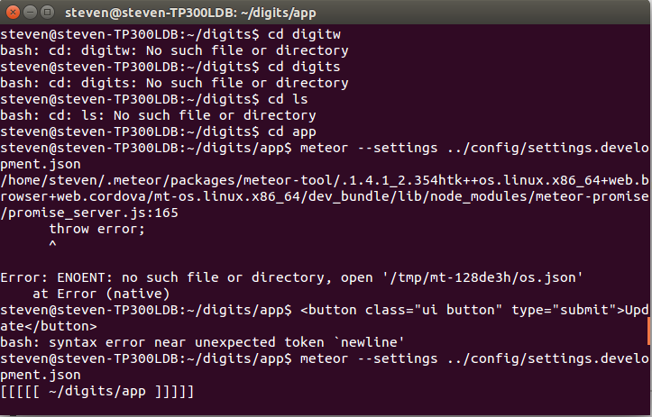

## Death by Meteor

When I had first started my meteor adventure, I was excited to be learning a new language, and as I stated in my other essay, I was elated to be able to add a new language to my programming arsenal. However, my happiness did not last long, as I was plagued by constant errors and the experience was not very enjoyable. I stayed up for days trying to fix the problems, even going as far as dual booting Ubuntu onto my laptop just to try and get it to work, but to no avail. The experience can best be described as getting hit on the head with “a small body of matter from outer space that enters the earth’s atmosphere, becoming incandescent as a result of friction and appearing as a streak of light” –(Johnson 2016). And unfortunately, due to the problems, I was not fully able to do the assignments and understand the syntax through doing it myself, and I just tried my best to learn through the screencasts. And with that said, this has to be the most difficult, unique, and problematic language I had ever tried to learn yet, so props to you, Meteor.

