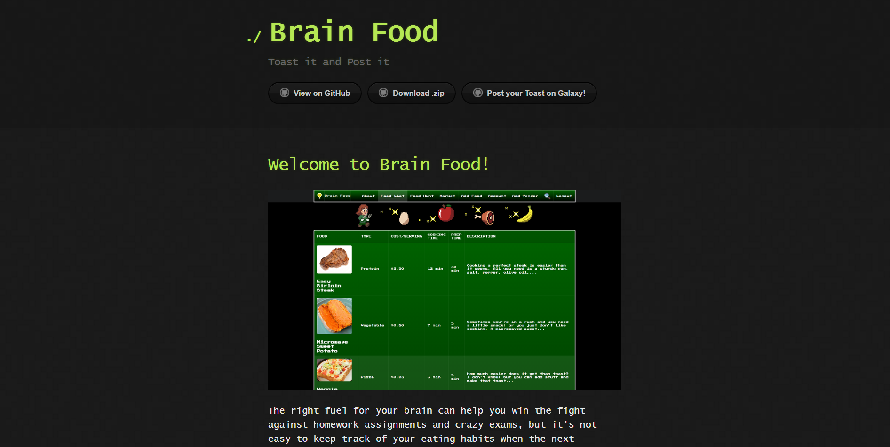

  

## Brain Food. Toast it and Post it!

The web application [Brain Food](https://brain-food.github.io/) was conceived by a group of Computer Science students at the University of Hawaii at Manoa, with the idea of promoting healthy food recipes to University of Hawaii students. It’s no surprise that college students have difficulty getting proper nutrition with an empty wallet, it’s so tempting to go to Mcdonald’s dollar menu rather than spending a $5 on a salad. But with an assignment peering around the corner at all times, it’s absolutely essential that students be eating properly to maintain a healthy state of mind and body when dealing with such stressful circumstances. Brain Food understands the common student’s nutritional dilemma, and hopes to level up student’s nutritional habits by offering a database where users can add and look for healthy and affordable recipes, as well as 
locations where to buy ingredients necessary. 

## Functionality

For this project, I collaborated with Kea Uehara, Riley Miyamoto, and Clint Morimoto. The project currently has a functioning add recipe page, which will add things to the Mongo database which will update and be shown in the food list page. The add location page is also functional and similar to the add recipe page, but instead has its information updated in the food-hunt page. There is also a functional comments section in the Market page.  My contributions to the project were updated the github.io page for Milestone updates, as well as creating the search page, place page, and functionality of the add location page. As of December 16, 2016, the search page and google maps page are not functional, although Brain Food developers are thinking about working on it after the class has finished. 

## Overall Experience

Out of all of the projects that I have completed so far, this was definitely the most difficult, as well as rewarding. I enjoyed working with my team members and couldn’t have asked for a better group. As a group, we needed to implement all of our skills with Meteor, Semantic-UI, CSS, HTML, and JavaScript, as well as artistic ability, to make Brain Food come alive. I’ve always wanted to create some sort of application that could be used by people, or that people actually want to use. It felt so rewarding creating something so beautiful that worked! I feel like through this experience, I’ve learned how to better work in a team, as this was the largest group project that I have done that took place over the course of a month and a half. I had to learn to adjust to my partner’s schedules for availability, since Riley for example, works 40 hours on Fri-Sun so working together on a weekends is ostensibly impossible. It was also the first time I had to give a presentation on a project and I feel like that helped improve my presentation skills, since I’m quite introverted and have always had difficulty in public speaking. Brain Food also felt like my group was creating an application that a customer would want, and we had to use our creativity and computer science and software engineering knowledge to adequately fulfill the customer’s needs. I had never felt like that on a project before, and hearing the positive feedback just made the experience all that more rewarding. Conclusively, Brain Food was the most difficult project I have worked on so far, but was an experience where I learned a lot about working in a group, and tested my knowledge in computer science and software engineering and one that I enjoyed thoroughly and will never forget.
